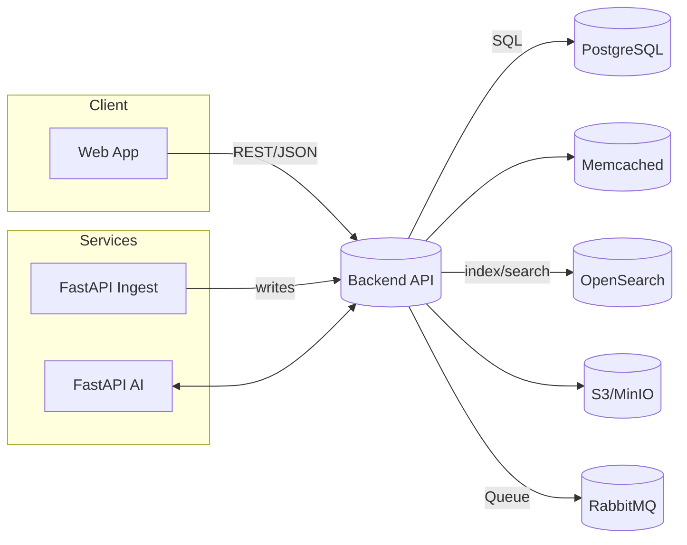

## Architektur (MVP)

```mermaid
flowchart LR
  subgraph Client
    Web[Web App]
  end

  Web -->|REST/JSON| Django[(Backend API)]
  Django -->|SQL| Postgres[(PostgreSQL)]
  Django --> Memcached[(Memcached)]
  Django -->|index/search| OpenSearch[(OpenSearch)]
  Django --> MinIO[(S3/MinIO)]
  Django -->|Queue| RabbitMQ[(RabbitMQ)]

  subgraph Services
    Ingest[FastAPI Ingest]
    AI[FastAPI AI]
  end

  Ingest -->|writes| Django
  AI <--> Django
```

Sicherheit: TLS vor Reverse Proxy, JWT/Session, Mandanten in allen Tabellen, Audit-Logs.

