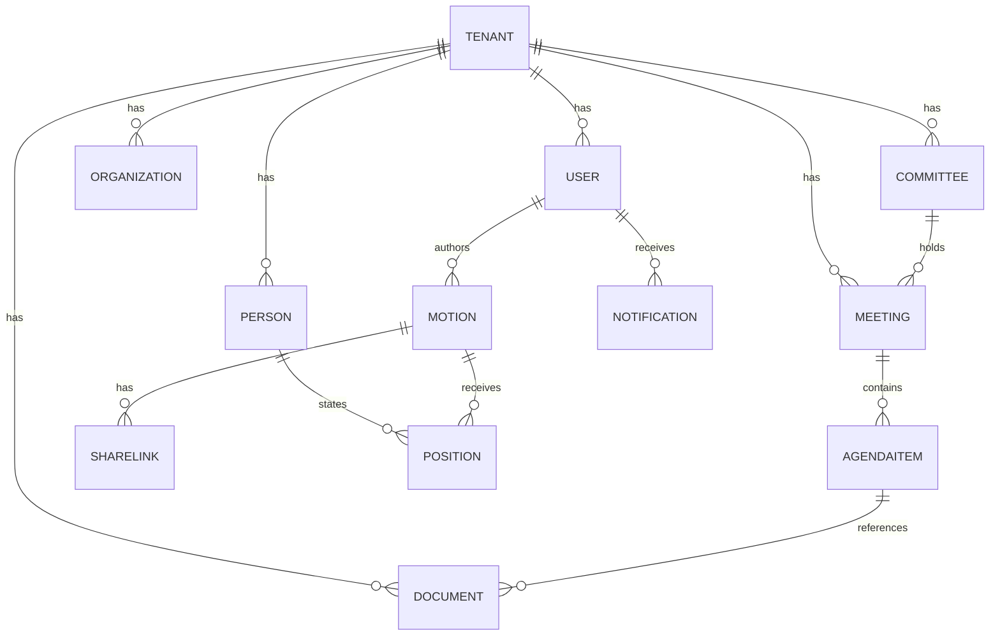

## ERD (vereinfacht)

```mermaid
erDiagram
  TENANT ||--o{ USER : has
  TENANT ||--o{ ORGANIZATION : has
  TENANT ||--o{ COMMITTEE : has
  TENANT ||--o{ PERSON : has
  TENANT ||--o{ MEETING : has
  TENANT ||--o{ DOCUMENT : has

  COMMITTEE ||--o{ MEETING : holds
  MEETING ||--o{ AGENDAITEM : contains
  AGENDAITEM ||--o{ DOCUMENT : references

  USER ||--o{ MOTION : authors
  MOTION ||--o{ SHARELINK : has
  PERSON ||--o{ POSITION : states
  MOTION ||--o{ POSITION : receives

  USER ||--o{ NOTIFICATION : receives
```

